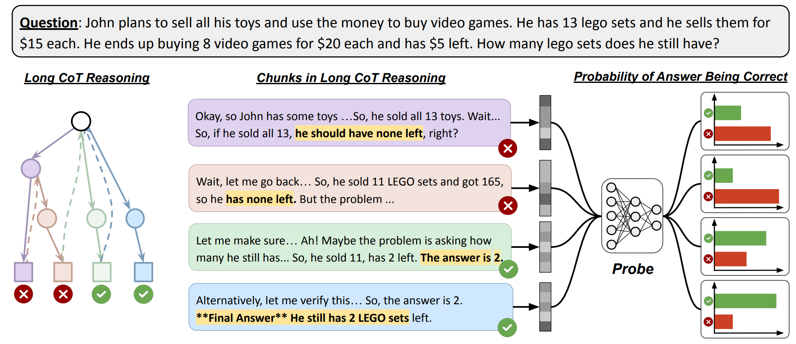
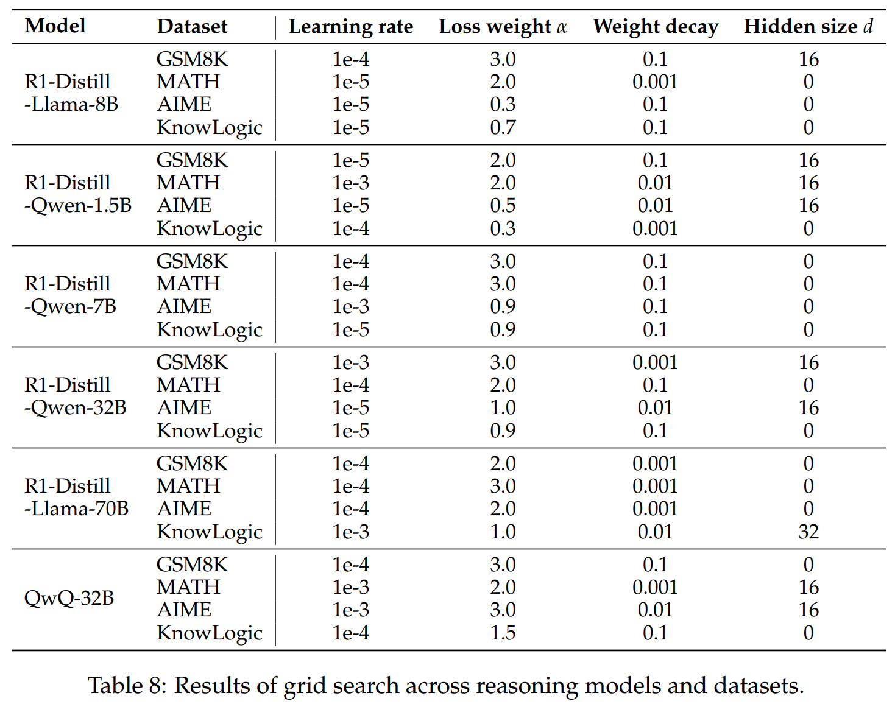

<h1 align="center">Reasoning Models Know When They're Right</h1>


<div align="center">
  
<p style="font-size: 18px;">
📄 <a href="https://arxiv.org/pdf/2504.05419">Paper</a> |
🔗 <a href="https://drive.usercontent.google.com/download?id=140GPBMca27-hAL5P8phK_jl2O9mReqo8&export=download&authuser=1&confirm=t&uuid=2302ab95-eb89-444e-aeed-8738a2c1d8b2&at=APcmpoyoq2GkpsrhGUK9W6EpyYoO:17446852776">Model</a> |
🤗 <a href="#">Data (Coming soon)</a>
</p>


</div>

Official code for ["Reasoning Models Know When They're Right: Probing Hidden States for Self-Verification"](https://arxiv.org/pdf/2504.05419) 




## 🔖 Table of Contents


- [Setup and Requirements](#setup-and-requirements)
- [Download Trained Probes](#download-trained-probes)
- [Train Your Own Probe](#train-your-own-probe)
  - [Data Preparation](#data-preparation) 
  - [Train Probes](#train-probs)
  - [Test Probes](#test-probes)


## 🔧 Setup and Requirements

```bash
conda create -n probe
conda activate probe
pip install -r requirements.txt
# download module for spacy (required for segmenting reasoning chunks)
python -m spacy download en_core_web_sm
```

## ⬇️ Download Trained Probes
- We provide trained probes for different model and dataset combinations. You can download them [here](https://drive.usercontent.google.com/download?id=140GPBMca27-hAL5P8phK_jl2O9mReqo8&export=download&authuser=1&confirm=t&uuid=2302ab95-eb89-444e-aeed-8738a2c1d8b2&at=APcmpoyoq2GkpsrhGUK9W6EpyYoO:17446852776).
    - the downloaded file contains a series of trained probe `pt` file.
    - the naming of each `pt` file follows `{model_name}_{train_data}_best_probe-{hyperparam_setting}.pt`
- If you want to use the probe off-the-shelf on other data, we recommend using the probe trained on **MATH** data as they usually show better generalizability.
- See below for how to [prepare your own test data](#data-preparation) and how to [evaluate the probe](#test-probes). 


## 🚀 Train Your Own Probe

### Data Preparation
#### 1. Generate CoT Reasoning
Generate Chain-of-Thought reasoning for each example in your dataset. We provide generated CoTs in [`./initial_cot`](./initial_cot).

```bash
# Set model path
model=/path/to/your/model/DeepSeek-R1-Distill-Qwen-1.5B

# Generate reasoning
python -u src/generate_reasoning.py \
    --data_name math-train \
    --model_path $model \
    --temperature 0.6 \
    --save_path ./initial_cot \
    --max_example 1000 # optional
```

#### 2. Extract Reasoning Chunks
Process the CoT outputs to identify reasoning chunks:

```bash
# Set variables
export SAVE_PATH="./processed_cot"
export NUM_PROCESSES=20  # Adjust based on CPU cores
export DATAFILE_PATH="./initial_cot/DeepSeek-R1-Distill-Qwen-1.5B_math-train_rollout_temperature0.6.jsonl"

# Process and segment reasoning paths
python src/get_reasoning_chunks.py \
    --datafile_path "$DATAFILE_PATH" \
    --save_path "$SAVE_PATH" \
    --num_processes "$NUM_PROCESSES" \
    --delete_chunks  # delete intermediate chunks after merging
```

#### 3. Label Intermediate Answers
Extract and label the correctness of intermediate answers in each chunk, meanwhile merging chunks that does not contain an answer with later chunks to ensure each chunk as an intermediate answer.

Note that we use Gemini API to extract and label the answers. You can also modify the [script](src/label_answer_correctness.py) to use other large language models for labeling.

```bash
# Set your Gemini API key
export GEMINI_API_KEY="your_api_key_here"

# Set paths
export SAVE_PATH="./labeled_cot"
export SEGMENT_PATH="./processed_cot/segmented_CoT_DeepSeek-R1-Distill-Qwen-1.5B_math-train_rollout_temperature0.6_merged.json"
export DATAFILE_PATH="./initial_cot/DeepSeek-R1-Distill-Qwen-1.5B_math-train_rollout_temperature0.6.jsonl"

# Label answers
python src/label_answer_correctness.py \
    --segmented_dataset_path "$SEGMENT_PATH" \
    --raw_CoT_path "$DATAFILE_PATH" \
    --save_path "$SAVE_PATH" \
    --num_processes 20 \
    --delete_chunks
```

#### 4. Generate Hidden State Representations
Extract hidden state representations for each reasoning chunk. Note that to save space, we control `chunk_size` for how many chunk representations are stored in each file.

```bash
# Set variables
model_name=DeepSeek-R1-Distill-Qwen-1.5B
model_path=/path/to/your/model/$model_name
dataset=math-train
temperature=0.6
input_file=./labeled_cot/labeled_intermediate_answers_${model_name}_${dataset}_rollout_temperature${temperature}.jsonl
for file_id in {0..19}
do
python -u src/get_representation.py \
    --input_file $input_file \
    --model_name $model_path \
    --save_path ./model_embeds/${model_name}_${dataset} \
    --bs 16 \
    --file_id $file_id \
    --file_size 50 # file size measured by number of questions, should not be too large because that would affect training data shuffling
done
```
### Train Probes
Train the probe for predicting answer correctness. Do grid search over each hyperparameter.

```bash
# Set paths
export MODEL=DeepSeek-R1-Distill-Qwen-1.5B
export DATA=math-train
export TRAIN_DATA_PATH=./model_embeds/${MODEL}_${DATA}


# Run default grid search to find optimal hyperparameters
bash train_probe.sh

# OR Train with best parameters (example configuration)
python -u ./src/train_predictor_with_class_weights.py \
    --epochs 200 \
    --lr 1e-5 \
    --hidden_size 0 \
    --wd 0.001 \
    --alpha_imbalance_penalty 2.0 \
    --threshold 0.5 \
    --train_data_dir $TRAIN_DATA_PATH \
    --save_model_path ./grid_search/${MODEL}_${DATA}/checkpoints \
    --store_path ./grid_search/${MODEL}_${DATA}/store \
    --model_name $MODEL
```

For data and models used in our paper, you can replicate the results with best hyperparameters for each model+dataset combination as below:



### Test Probes

To test your probe on test data, first follow [data preparation steps](#data-preparation) as above to obtain representations on test data in the same manner. Then evaluate the best trained probe on your test data.

```bash
model=DeepSeek-R1-Distill-Qwen-1.5B
data=math-train

TEST_SAVE_PATH=./test_result
TEST_DATA=./model_embeds/${model}_math_500

python -u ./test_predictor_with_class_weights.py \
    --input_size $INPUT_SIZE \
    --threshold 0.5 \
    --test_data_dir $TEST_DATA \
    --save_path $TEST_SAVE_PATH \
    --model_name $model \
    --checkpoint_model_path /path/to/best/probe/pt 
```

We also provide script to automatically run evaluation on top-k best trained probes in grid search.
Note that in [`src/test_predictor_with_class_weights.py`](./src/test_predictor_with_class_weights.py), we default to use `best_val_acc` as metric for ranking the probes. You can also customize the metric by yourself.

```bash
model=DeepSeek-R1-Distill-Qwen-1.5B
data=math-train

MODEL_BASE_PATH=./grid_search/${model}_${data}
GRID_SEARCH_PATH=$MODEL_BASE_PATH/grid_search_result.jsonl
TEST_SAVE_PATH=$MODEL_BASE_PATH/test_result

TEST_DATA=./model_embeds/${model}_math_500
python -u ./test_predictor_with_class_weights.py \
    --input_size $INPUT_SIZE \
    --threshold 0.5 \
    --test_data_dir $TEST_DATA \
    --grid_search_result_path $GRID_SEARCH_PATH \
    --topk 10 \ # test top-k probes from grid search results
    --save_path $TEST_SAVE_PATH \
    --model_name $model
```


## 📝 Citation

If you find our code or data useful, please cite our paper:
```bibtex
@misc{zhang2025reasoningmodelsknowtheyre,
      title={Reasoning Models Know When They're Right: Probing Hidden States for Self-Verification}, 
      author={Anqi Zhang and Yulin Chen and Jane Pan and Chen Zhao and Aurojit Panda and Jinyang Li and He He},
      year={2025},
      eprint={2504.05419},
      archivePrefix={arXiv},
      primaryClass={cs.AI},
      url={https://arxiv.org/abs/2504.05419}, 
}
```
